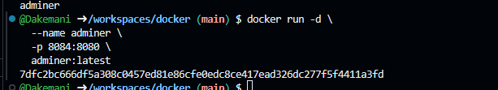
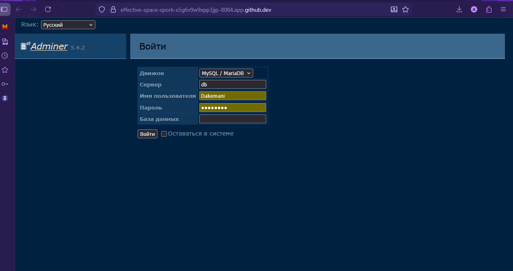

Вот README только с тем, что выполнено на вашем фото:

```markdown
# Adminer в Docker

## 1. Запуск контейнера

```bash
docker run -d \
    --name adminer \
    -p 8084:8080 \
    adminer:latest
```



---

## 2. Страница входа

Открыт браузер по адресу `http://localhost:8084`



---
