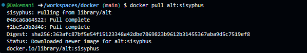
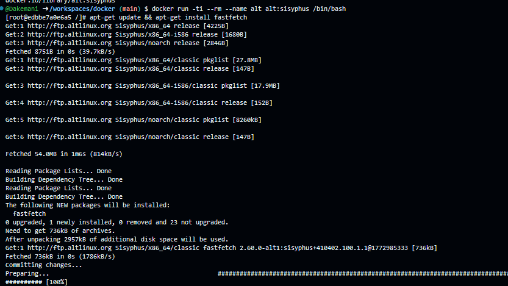
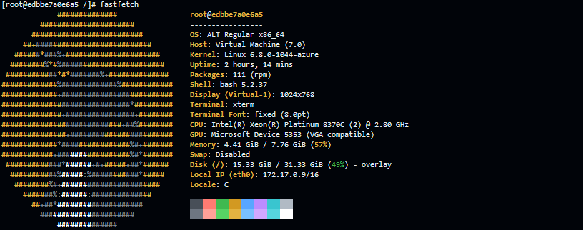

Вот README только с тем, что выполнено на вашем фото:

```markdown
# ALT Linux в Docker

## 1. Запуск контейнера ALT Linux

```bash
docker run -ti --rm --name alt alt:sisyphus /bin/bash
```



---

## 2. Обновление пакетов и установка fastfetch

```bash
apt-get update && apt-get install fastfetch -y
```

**Результат:**
- Выполнено обновление списка пакетов
- Установлен fastfetch версии 2.60.0



---

## 3. Запуск fastfetch

```bash
fastfetch
```

**Результат:**
- OS: ALT Regular x86_64
- Kernel: Linux 6.8.0-1844-azure
- Packages: 111 (rpm)
- CPU: Intel Xeon Platinum 8370C
- Memory: 4.41 GiB / 7.76 GiB (57%)


---

## 4. Выход из контейнера

```bash
exit
```


