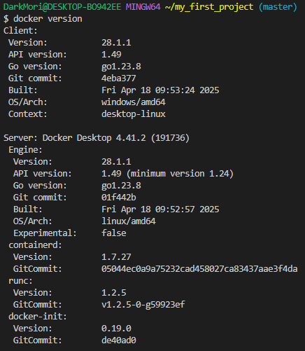
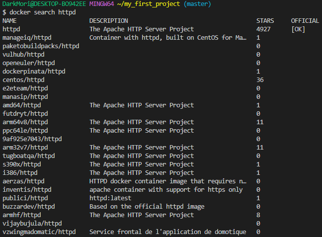
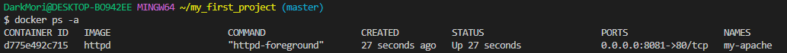
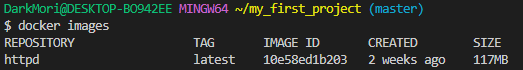
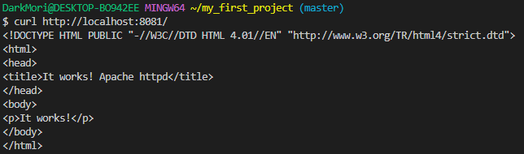
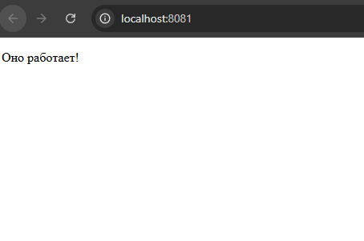
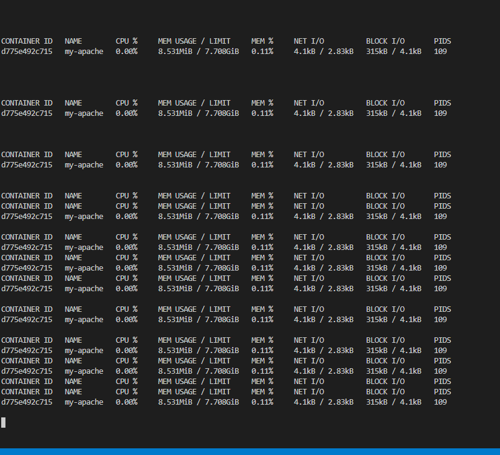
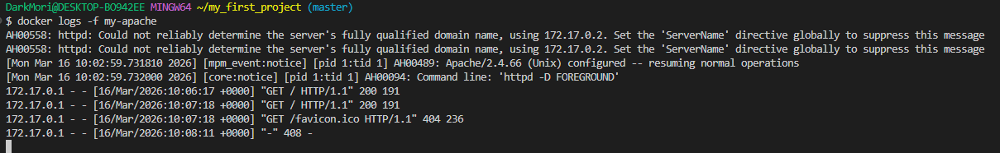
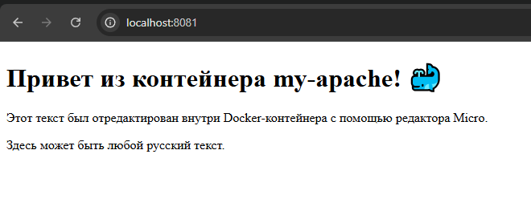
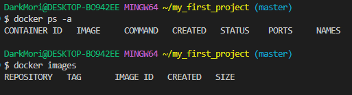

## Практическая работа на примере готового образа httpd (Apache) в Docker

> **Apache HTTP Server** (`httpd`) - это популярный, мощный и гибкий веб-сервер с открытым исходным кодом.

> Никогда в разработке не используйте русские имена файлов и каталогов!
> Никогда в разработке не используйте пробелы и спец.символы в именах файлов и каталогов!

## Этапы

### 1. Проверка Docker

Получил версию установленного Docker:

```shell
docker version
```



### 2. Получение готового образа httpd (Apache)

Нашел нужный образ на **Docker Hub**:
```shell
docker search httpd
```



Получил, создал и запустил контейнер с Apache одной командой:

```shell
docker run -d --name my-apache -p 8081:80 httpd
```

*   `docker run` — объединяет команды `pull`, `create` и `start`.
*   `-d` — запускает контейнер в фоновом режиме (detached).
*   `--name my-apache` — задает имя контейнеру `my-apache`.
*   `-p 8081:80` — публикует порт: порт 80 контейнера (где работает Apache) пробрасывается на порт 8081 локальной машины.
*   `httpd` — имя образа, который будет скачан с Docker Hub.

Проверил, что контейнер создан и запущен:
```shell
docker ps -a
```



Показал загруженный образ:
```shell
docker images
```



Проверил работу веб-сервера:

**Способ 1 (через curl):**
```shell
curl http://localhost:8081/
```



**Способ 2 (через браузер):** [Открыл адрес http://localhost:8081](http://localhost:8081)



### 3. Управление контейнером

#### Мониторинг контейнера

Показал состояние всех контейнеров:
```shell
docker ps -a
```

Показал подробности о контейнере:
```shell
docker inspect my-apache
```

Запустил мониторинг ресурсов контейнера:
```shell
docker stats
```



> Выйти из мониторинга — `Ctrl+C`

Получил логи контейнера:
```shell
docker logs my-apache
```

Показал логи в режиме реального времени:
```shell
docker logs -f my-apache
```
> Выйти из режима ожидания — `Ctrl+C`



#### Редактирование веб-страницы

Зайти в контейнер:
```shell
docker exec -it my-apache bash
```

Внутри контейнера установил текстовый редактор Micro:
```shell
apt update && apt install -y micro
```

Открыл файл `index.html` для редактирования:
```shell
micro /usr/local/apache2/htdocs/index.html
```
*   Путь к директории с сайтом по умолчанию для официального образа `httpd` — `/usr/local/apache2/htdocs/`.

Вставил мета-тег для поддержки русского языка и отредактировал содержимое файла `index.html`:

```html
<html><body><h1>It works!</h1></body></html>
```
был изменен на:
```html
<!DOCTYPE html>
<html>
<head>
    <meta charset="UTF-8">
    <title>Приветственная страница Apache</title>
</head>
<body>
    <h1>Привет из контейнера my-apache! 🐳</h1>
    <p>Этот текст был отредактирован внутри Docker-контейнера с помощью редактора Micro.</p>
    <p>Здесь может быть любой русский текст.</p>
</body>
</html>
```
*   Сохранил изменения: `Ctrl+S`
*   Вышел из редактора: `Ctrl+Q`

Вышел из контейнера:
```shell
exit
```

[Проверил результат по адресу http://localhost:8081](http://localhost:8081)



#### Управление контейнером (закрепление)

Остановил контейнер:
```shell
docker stop my-apache
```
Снова запустил контейнер:
```shell
docker start my-apache
```
Перезапустил контейнер:
```shell
docker restart my-apache
```

### Заключительная очистка

Остановил все запущенные контейнеры:
```shell
docker stop $(docker ps -q)
```

Удалил все остановленные контейнеры:
```shell
docker container prune -f
```

Удалил все образы:
```shell
docker rmi $(docker images -q) -f
```

Проверил, что все чисто:
```shell
docker ps -a
docker images
```

