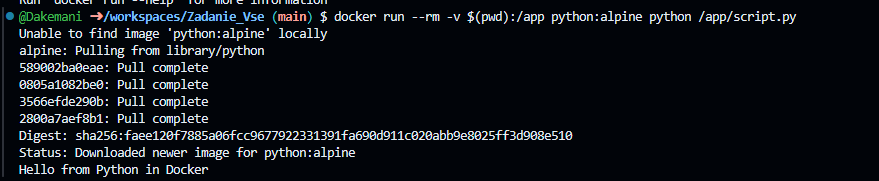
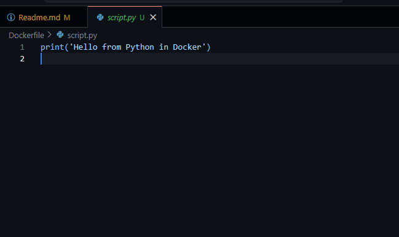

```markdown
# Работа с Python в Docker

## Описание работы

В данном проекте выполнено знакомство с запуском Python-скриптов внутри Docker-контейнеров. Работа демонстрирует базовые принципы контейнеризации Python-приложений с использованием официального образа `python:alpine`.

## Выполненные задачи

### 1. Создание Python-скрипта

Создан файл `script.py` с простым выводом сообщения:

```python
print("Hello from Python in Docker")
```


### 2. Запуск скрипта в Docker-контейнере

Выполнен запуск скрипта с монтированием текущей директории в контейнер:

```bash
docker run --rm -v $(pwd):/app python:alpine python /app/script.py
```


**Результат:**
```
Hello from Python in Docker
```


### 3. Интерактивный режим Python

Запущен интерактивный сеанс Python в контейнере:

```bash
docker run -it --rm python:alpine python
```

**Результат:**
```
Python 3.14.3 (main, Feb  4 2026, 20:07:43) [GCC 15.2.0] on linux
Type "help", "copyright", "credits" or "license" for more information.
>>>
```
