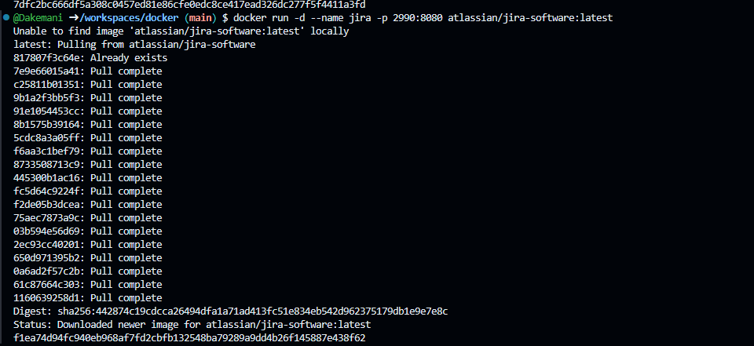
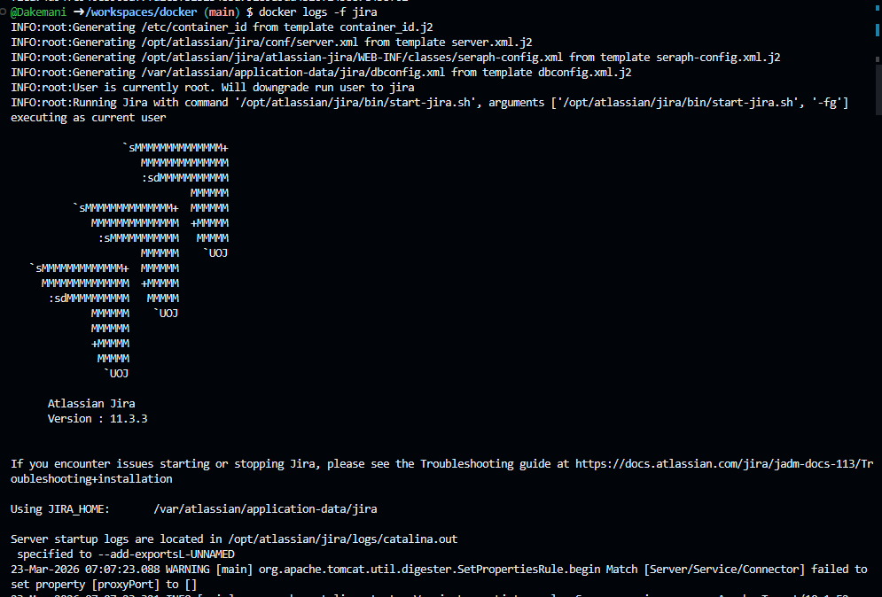
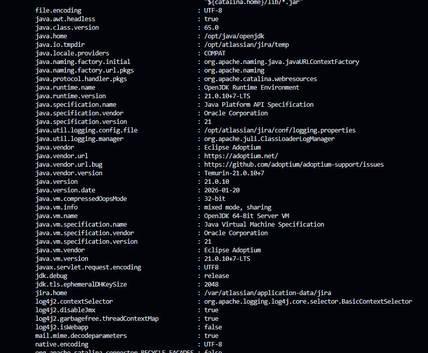
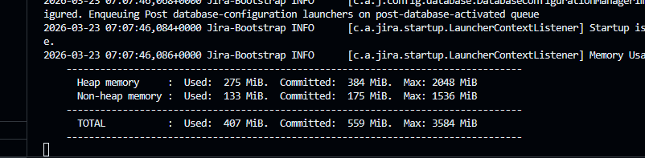
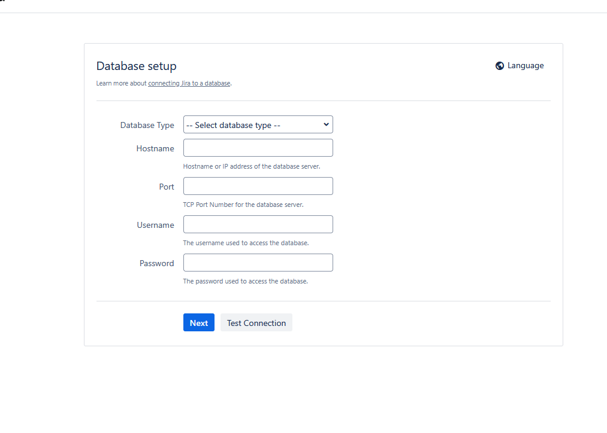

Вот README только с тем, что выполнено на вашем фото:

```markdown
# Jira в Docker

## 1. Запуск контейнера

```bash
docker run -d --name jira -p 2990:8080 atlassian/jira-software:latest
```



---

## 2. Просмотр логов

```bash
docker logs -f jira
```






---

## 3. Страница установки

Открыт браузер с формой настройки базы данных


```

