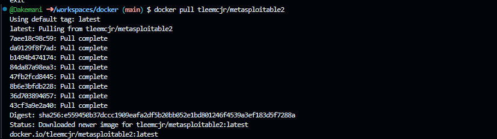
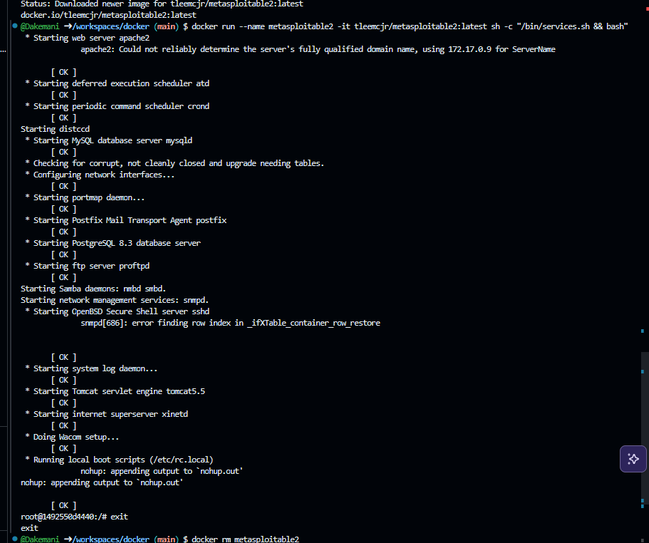
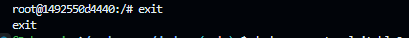
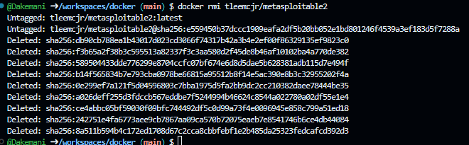

Вот README только с тем, что выполнено на вашем фото:

```markdown
# Metasploitable2 в Docker

## 1. Скачивание образа

```bash
docker pull tleemcjr/metasploitable2
```


---

## 2. Запуск контейнера

```bash
docker run --name metasploitable2 -it tleemcjr/metasploitable2:latest sh -c "/bin/services.sh && bash"
```

**Результат:**
- Запущены сервисы: Apache2, MySQL, PostgreSQL, SSH, FTP, Samba, Tomcat и др.
- Получен доступ к shell контейнера


---

## 3. Выход из контейнера

```bash
exit
```


---

## 4. Удаление контейнера

```bash
docker rm metasploitable2
```

<!-- 📸 ФОТО 4: скриншот удаления контейнера -->

---

## 5. Удаление образа

```bash
docker rm tleemcjr/metasploitable2
```


```

## 📍 Метки для фото:

| Метка | Что на скриншоте |
|-------|------------------|
| **📸 ФОТО 1** | Команда `docker pull` с загрузкой образа |
| **📸 ФОТО 2** | Команда `docker run` с запуском сервисов и входом в shell |
| **📸 ФОТО 3** | Команда `exit` и выход из контейнера |
| **📸 ФОТО 4** | Команда `docker rm metasploitable2` |
| **📸 ФОТО 5** | Команда `docker rm tleemcjr/metasploitable2` с удалением образа |