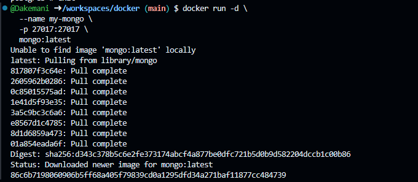
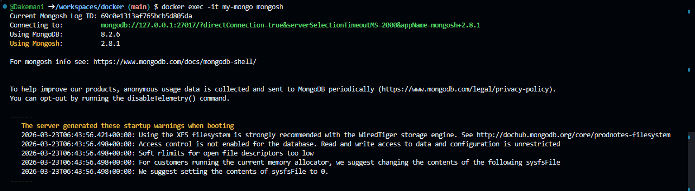
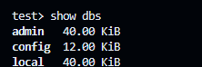
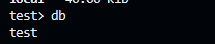
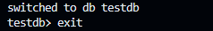

Вот README только с тем, что выполнено на вашем фото:

```markdown
# MongoDB в Docker

## 1. Запуск контейнера

```bash
docker run -d \
    --name my-mongo \
    -p 27017:27017 \
    mongo:latest
```



---

## 2. Подключение к MongoDB

```bash
docker exec -it my-mongo mongosh
```



---

## 3. Команды MongoDB

### Показать все базы данных
```javascript
show dbs
```

### Показать текущую базу данных
```javascript
db
```

### Переключиться на базу данных
```javascript
use testdb
```

<!-- 📸 ФОТО 3: скриншот выполнения команд -->

---

## 4. Выход

```javascript
exit
```
