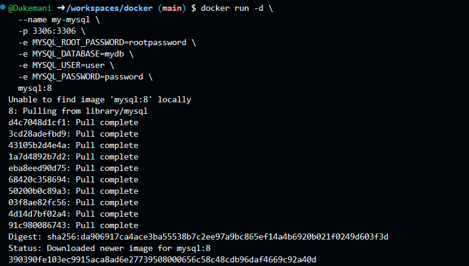
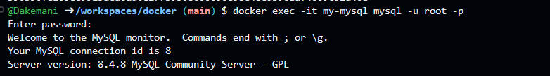
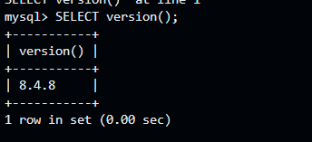

Вот обновленная краткая версия README:

```markdown
# MySQL в Docker

## 1. Запуск контейнера

```bash
docker run -d \
--name my-mysql \
-p 3306:3306 \
-e MYSQL_ROOT_PASSWORD=rootpassword \
-e MYSQL_DATABASE=mydb \
-e MYSQL_USER=user \
-e MYSQL_PASSWORD=password \
mysql:8
```



## . Подключение к MySQL

```bash
docker exec -it my-mysql mysql -u root -p
```



**Получить список баз данных::** 
```bash
sql
```

**Получить версию:** 

```bash
SELECT version
```



## . Выход

```sql
exit
```


