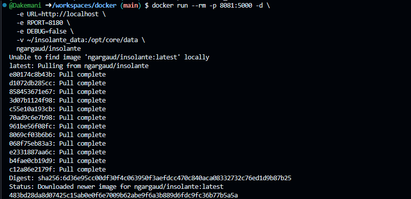
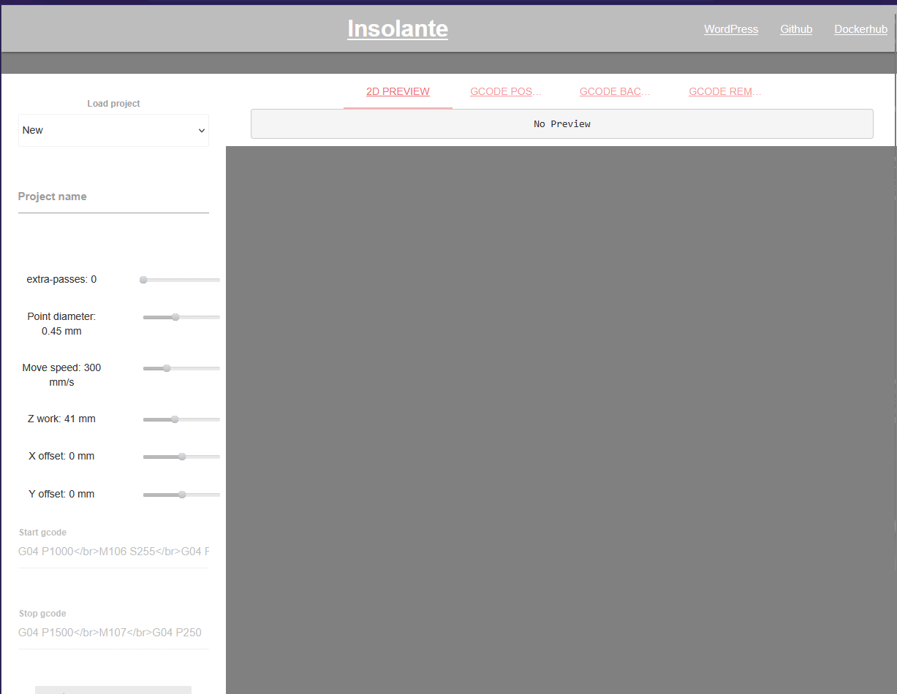

Вот README только с тем, что выполнено на вашем фото:

```markdown
# Insolante в Docker

## 1. Запуск контейнера

```bash
docker run --rm -p 8081:5000 -d \
    -e URL=http://localhost \
    -e RPORT=8180 \
    -e DEBUG=false \
    -v ~/insolante_data:/opt/core/data \
    ngargaud/insolante
```

**Результат:**
- Образ `ngargaud/insolante:latest` загружен из Docker Hub
- Контейнер создан с ID: `483bd28da8d7...`



---

## 2. Страница Insolante

Открыт браузер с интерфейсом Insolante

Отображаются:
- **Load project**
- **New** с параметрами:
  - Project name
  - extra-passes: 0
  - Point diameter: 0.45 mm
  - Move speed: 300 mm/s
  - Z work: 41 mm
  - X offset: 0 mm
  - Y offset: 0 mm
- **Start gcode:** `G04 P1000</br>M106 S255</br>G04 F`
- **Stop gcode:** `G04 P1500</br>M107</br>G04 P250`


