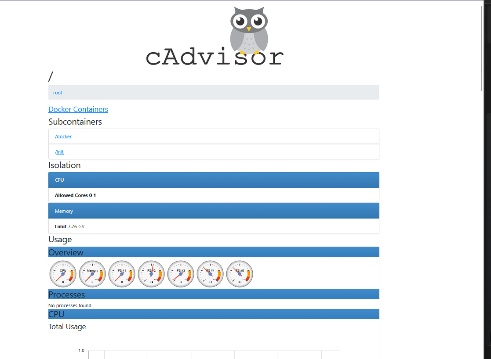
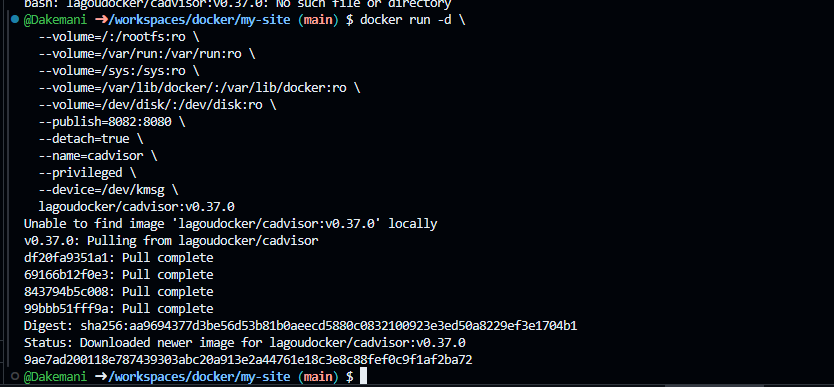
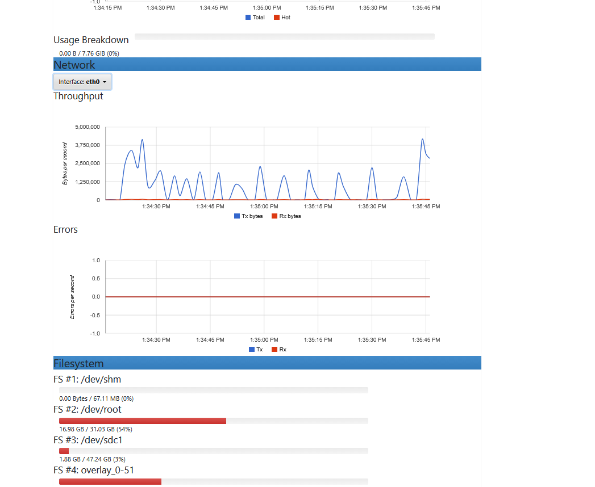

# Мониторинг Docker-контейнеров с помощью cAdvisor

В этом репозитории представлен результат выполнения практического задания по развертыванию системы мониторинга контейнеров.

**Задача:** Запустить контейнер с cAdvisor для сбора и визуализации метрик Docker-контейнеров, а также проверить его работоспособность.

## 🚀 Результат

cAdvisor успешно развернут в Docker-окружении. Веб-интерфейс доступен и отображает статистику по запущенным контейнерам в реальном времени.



## ✅ Что было сделано

1.  **Проверка порта:** Перед запуском контейнера выполнена проверка, что порт `8082` свободен (команды `netstat -tuln | grep :8082` для Linux/Mac или `netstat -aon | findstr :8082` для Windows).
2.  **Запуск контейнера:** Использован образ `lagoudocker/cadvisor:v0.37.0`. Контейнер запущен с необходимыми привилегиями и пробросом портов для сбора метрик с хостовой машины.
3.  **Верификация:** Проверен список запущенных контейнеров (`docker ps`), чтобы убедиться, что cAdvisor работает без ошибок.
4.  **Доступ к интерфейсу:** Открыт веб-интерфейс по адресу `http://localhost:8082`.

**[!]
## 🛠 Используемые технологии и инструменты

*   **Docker** (контейнеризация)
*   **cAdvisor** (инструмент мониторинга от Google)
*   **ОС:** [Укажите свою ОС, например: Ubuntu 22.04 (WSL 2) / Windows 11]

## 📊 Интерфейс мониторинга

Веб-интерфейс cAdvisor предоставляет детальную информацию о каждом контейнере:

*   Использование CPU и памяти (в виде графиков и цифр).
*   Сетевая активность.
*   Файловая система.
*   Процессы внутри контейнера.



## ⚙️ Команды для запуска (справочно)

Проект запускается одной командой. Ниже приведен использованный вариант (для Linux/WSL 2.0/Mac):

```bash
docker run -d \
    --volume=/:rootfs:ro \
    --volume=/var/run:/var/run:ro \
    --volume=/sys:/sys:ro \
    --volume=/var/lib/docker:/var/lib/docker:ro \
    --volume=/dev/disk:/dev/disk:ro \
    --publish=8082:8080 \
    --detach=true \
    --name=cadvisor \
    --privileged \
    --device=/dev/kmsg \
    lagoudocker/cadvisor:v0.37.0