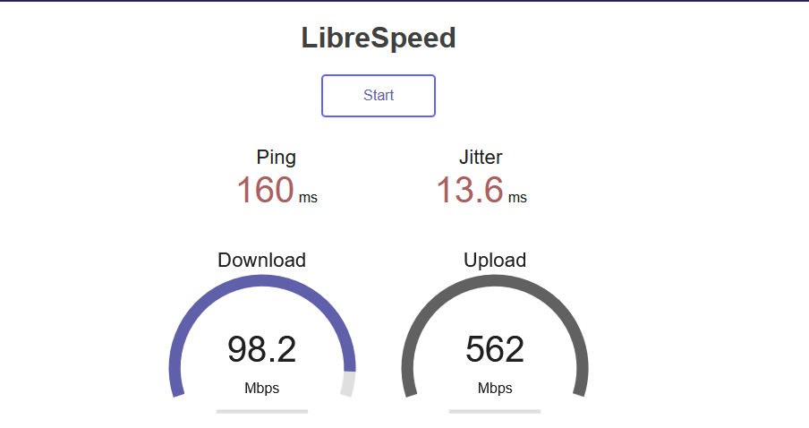

# Speedtest Server Docker Container

## Описание

Данный контейнер разворачивает сервер для тестирования скорости интернета на базе образа [adolfintel/speedtest](https://hub.docker.com/r/adolfintel/speedtest). Сервер позволяет проводить тесты скорости загрузки и отдачи данных через веб-интерфейс.



*Рисунок 1: Главный экран Speedtest сервера*

## Команда запуска

```bash
docker run -d -p 158:80 --name speedtest-server adolfintel/speedtest