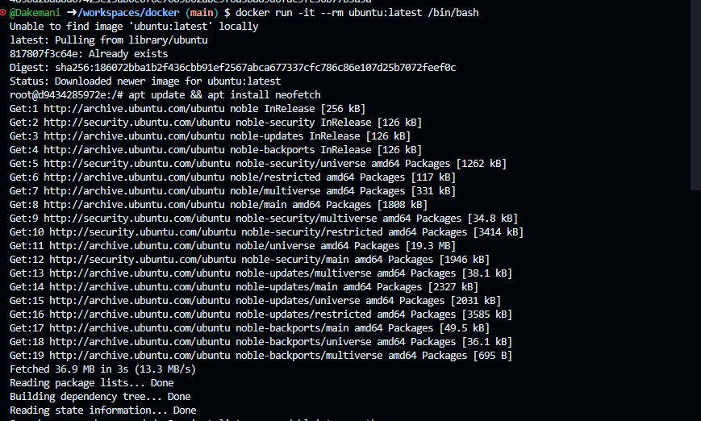

Вот README только с тем, что выполнено на вашем фото:

```markdown
# Ubuntu в Docker

## 1. Запуск контейнера Ubuntu

```bash
docker run -it --rm ubuntu:latest /bin/bash
```

**Результат:**
- Образ `ubuntu:latest` загружен
- Запущен интерактивный контейнер
- Получен доступ к shell от root



---

## 2. Обновление пакетов и установка neofetch

```bash
apt update && apt install neofetch -y
```

**Результат:**
- Выполнено обновление списка пакетов
- Установлен пакет neofetch

## 📍 Метки для фото:
