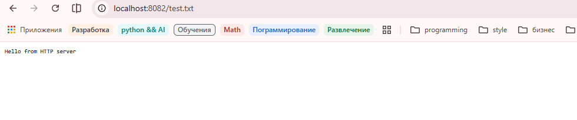

# HTTP Server Files

В этой работе я запустил контейнер Nginx для раздачи файлов из локальной папки.
Такой контейнер удобен, когда нужно быстро открыть файлы по HTTP и проверить, что они доступны по ссылке.

## Подготовка файла

```powershell
echo "Hello from HTTP server" > test.txt
```

## Команда запуска

```powershell
docker run -d --name http-server -p 8082:80 -v ${PWD}:/usr/share/nginx/html nginx:alpine
```

## Проверка

```powershell
curl http://localhost:8082/test.txt
```

Я проверил, что файл из локальной папки открывается через браузер и через curl.


