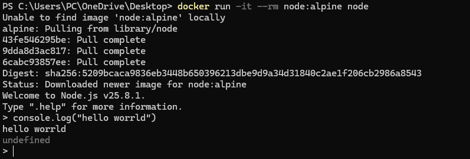
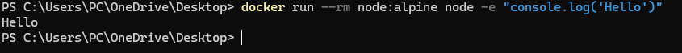

# Node.js

В этой работе я запустил контейнер Node.js и проверил выполнение JavaScript-кода.
Контейнер Node.js подходит для запуска JavaScript-кода, тестирования небольших примеров и проверки работы среды без локальной установки Node.js.

## Команды

```powershell
docker run -it --rm node:alpine node
```



В интерактивном режиме я выполнил:

```javascript
console.log("Hello from Docker!");
```

Также я проверил короткий запуск одной командой:

```powershell
docker run --rm node:alpine node -e "console.log('Hello')"
```

## Проверка

Я убедился, что контейнер запускает Node.js и выводит результат выполнения скрипта.


