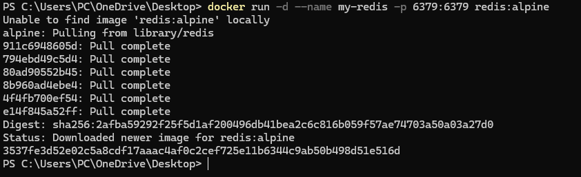
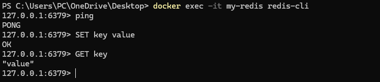

# Redis

В этой работе я запустил контейнер Redis и проверил его через redis-cli.
Redis это быстрая база данных типа ключ-значение, которую часто используют для кеша, очередей и хранения временных данных.

## Команда запуска

```powershell
docker run -d --name my-redis -p 6379:6379 redis:alpine
```



## Проверка

```powershell
docker exec -it my-redis redis-cli
ping
SET key value
GET key
exit
```

Я проверил, что Redis отвечает на команды и сохраняет значение ключа.


